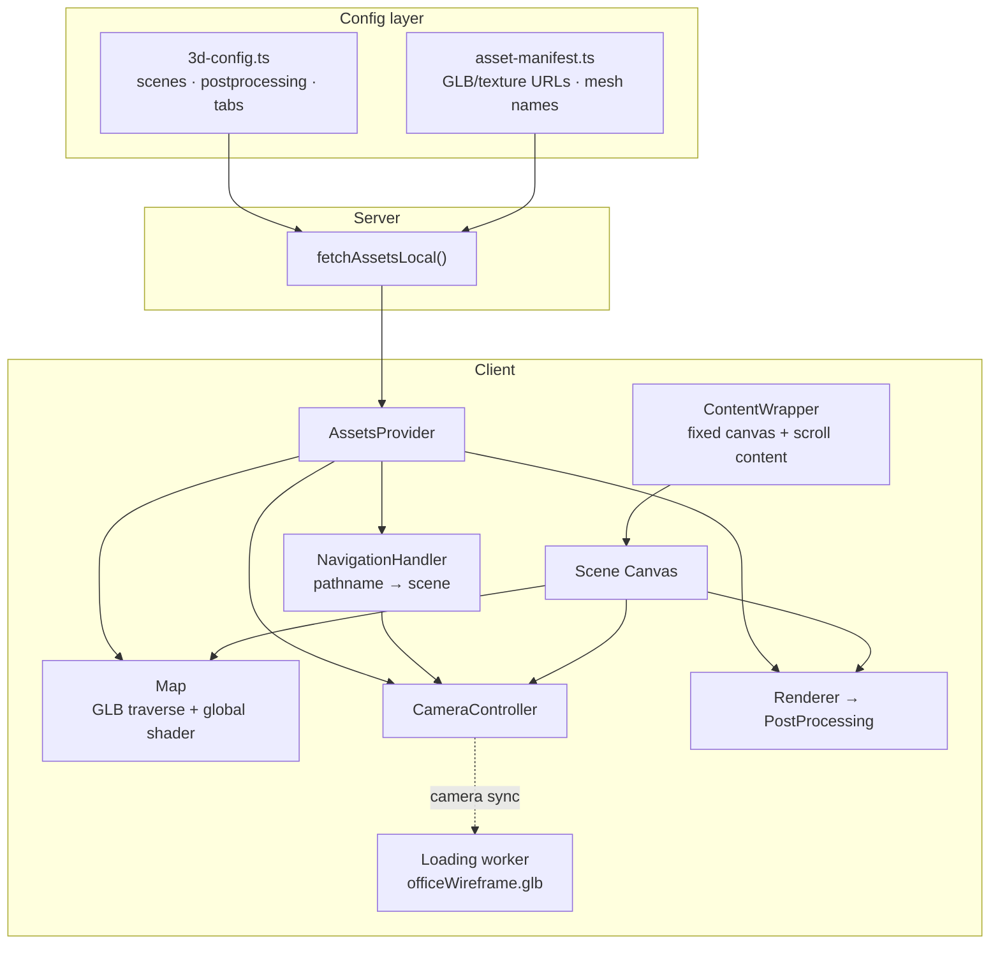

# Responsive 3D Hero (R3F Wireframe)

Build a **fixed-viewport 3D hero** with scrollable HTML content, per-route cameras, and a wireframe-to-solid loading handoff — the pattern from [basement.studio](https://basement.studio) / `website-2k25` (basement-studio-clean fork).

**Reference repo (read-only):** `website-2k25` — study these paths first:

| Layer | Path |
|-------|------|
| Scene config (hardcoded) | `src/content/3d-config.ts` |
| Asset URLs + mesh lists | `src/lib/3d-config/asset-manifest.ts` |
| Runtime merge | `src/components/assets-provider/fetch-assets-local.ts` |
| Layout + canvas shell | `src/components/layout/content-wrapper.tsx` |
| R3F scene | `src/components/scene/index.tsx` |
| Map + materials | `src/components/map/` |
| Camera | `src/components/camera/` |
| Postprocessing | `src/components/postprocessing/` |
| Route → scene | `src/components/navigation-handler/index.tsx` |
| Wireframe loader | `src/components/loading/`, `src/workers/loading-worker.tsx` |

Deep dives: [references/html-layout.md](references/html-layout.md) · [references/architecture.md](references/architecture.md) · [references/config-and-pitfalls.md](references/config-and-pitfalls.md) · [references/loading-and-shaders.md](references/loading-and-shaders.md)

## HTML content layout (read before writing JSX)

**Most common scaffold bug:** multiple headlines stacked, field-notes cards overlapping the h1, unreadable z-index mess. Root cause is almost always **HTML placed on the canvas layer** instead of in scroll flow below it.

### Two layers — never merge them

| Layer | What lives here | Position |
|-------|-----------------|----------|
| **Canvas** | R3F `<Scene />`, wireframe loader only | `lg:fixed lg:h-[100svh] lg:z-0` |
| **HTML content** | h1, body, CTAs, spec cards, field notes | Normal flow in `layout-container` with `lg:mt-[100dvh]` |

On desktop the canvas is pinned for the first viewport. Page copy starts **below** that viewport (`lg:mt-[100dvh]`), then scrolls up over the 3D background. **Do not** put hero headlines or spec cards in `absolute`/`fixed` positions over the canvas.

### Hard rules

1. **One h1 per route** — subtitle is `<p>`, not a second headline block.
2. **Never stack two hero copy blocks** at the same viewport position (no overlay h1 + Intro h1).
3. **Field notes / spec cards** (MOBILE, DESKTOP, ROUTES) go in a section **below** Intro, or in a sidebar grid column — not at `top-0` overlapping the h1.
4. **Required shell:** ContentWrapper with canvas div + `layout-container` children (see template below).
5. **Z-index:** canvas `z-0`, content `z-10`, navbar/modals `z-50+`.

Full anti-patterns, grid sidebar pattern, and symptom table: **[references/html-layout.md](references/html-layout.md)**.

## When to use

- Full-bleed 3D hero behind scrollable page content
- Wireframe GLB intro that morphs into the live scene camera
- Multiple routes sharing one persistent canvas with different camera poses
- Custom shader look (not stock `MeshStandardMaterial`)
- **No CMS** — hardcoded TypeScript config + `public/3d/` assets

## When NOT to use

- Simple CSS 3D transforms or parallax images
- Product configurators needing heavy CAD tooling
- Full game loop (use a game engine or isolate minigames)

## Stack (pinned versions from reference)

```json
"@react-three/fiber": "9.x",
"@react-three/drei": "10.x",
"@react-three/offscreen": "1.x",
"@react-three/rapier": "1.x",
"three": "0.180+",
"maath": "0.10+",
"motion": "12+"
```

Optional dev-only: `leva` for camera/postprocessing tuning. **Never ship fly mode enabled by default.**

## Architecture (summary)



**Data split (critical):**

| Data | File | Edit how |
|------|------|----------|
| Binary assets | `public/3d/{models,textures,audio,video}/` | Hash-rename on change |
| URLs, mesh name lists, bakes | `asset-manifest.ts` | Hand-edit |
| Per-route camera, postFX, tabs | `3d-config.ts` | Hand-edit (or export from Sanity upstream) |
| Runtime shape | `fetch-assets-local.ts` | Join manifest + config → `AssetsResult` |

Do **not** fetch scene cameras from a CMS unless you have a real export pipeline. Empty placeholder config = broken cameras.

## Replication checklist

Copy and track:

```
3D hero checklist:
- [ ] 1. Dependencies installed (fiber, drei, three, maath)
- [ ] 2. public/3d/ tree + content-hashed filenames
- [ ] 3. asset-manifest.ts with every /3d/ URL
- [ ] 4. 3d-config.ts with ≥1 scene (camera + postprocessing)
- [ ] 5. fetch-assets-local.ts merge → AssetsResult interface
- [ ] 6. Site layout: await fetchAssets() → AssetsProvider
- [ ] 7. ContentWrapper: fixed canvas + `layout-container` with `lg:mt-[100dvh]` (see html-layout.md)
- [ ] 7b. ONE h1 on homepage; field notes / spec cards in section below Intro — not overlapping
- [ ] 8. Scene: dynamic import, ssr:false, frameloop demand
- [ ] 9. NavigationHandler: pathname → currentScene
- [ ] 10. Map: useKTX2GLTF + traverse → global shader materials
- [ ] 11. CameraController: CustomCamera (fly mode off)
- [ ] 12. Renderer portal + postprocessing per scene
- [ ] 13. Loading worker + officeWireframe GLB (optional but signature)
- [ ] 14. next.config immutable cache for /3d/*
- [ ] 15. Run scripts/verify-3d-assets.mjs — all green
- [ ] 16. rm -rf .next after asset URL changes; hard refresh
```

## Step-by-step workflow

### 1 — Asset pipeline

1. Place GLBs under `public/3d/models/`.
2. Content-hash every file: `name-<sha8>.glb` (see `scripts/verify-3d-assets.mjs`).
3. Register URLs in `asset-manifest.ts` (`ASSETS_BASE`).
4. Set long-cache headers in `next.config` for `/3d/:path*` (`immutable`, 1 year) — safe only with hashed names.

**Verify:** `node skills/responsive-3d-hero/scripts/verify-3d-assets.mjs path/to/asset-manifest.ts`

### 2 — Scene config (no Sanity)

Create `src/content/3d-config.ts`:

```ts
export const THREE_D_CONFIG = {
  scenes: [{
    sceneName: "home",
    cameraConfig: {
      posX: 6.26, posY: 1.16, posZ: -7.57,
      tarX: 5.93, tarY: 1.29, tarZ: -8.51,
      fov: 64.65,
      targetScrollY: -0.1,
      offsetMultiplier: 0.25  // pointer parallax strength; 0 to disable
    },
    postprocessing: {
      contrast: 1, brightness: 0.31, exposure: 0.54, gamma: 0.73,
      vignetteRadius: 0.8, vignetteSpread: 0.75,
      bloomStrength: 0.15, bloomRadius: 5, bloomThreshold: 10
    },
    tabs: []  // optional: mesh-name → route hotspots
  }],
  inspectables: [],
  physics: { physicsParams: [] }
}
export async function fetchThreeDConfig() { return THREE_D_CONFIG }
```

Merge in `fetch-assets-local.ts` — map flat `posX/tarX` to `[x,y,z]` tuples (see reference file).

### 3 — Layout integration

**Read [references/html-layout.md](references/html-layout.md) first.** This step is where scaffolds break if skipped.

**`content-wrapper.tsx` pattern (required):**

```tsx
<>
  {/* Canvas — Scene only, no hero copy here */}
  <div className="canvas-container relative h-[80svh] w-full lg:fixed lg:h-[100svh] lg:z-0">
    <Scene />
  </div>

  {/* All page HTML — scroll flow, starts below fixed canvas on desktop */}
  <div className={cn("layout-container relative z-10", shouldShowCanvas && "lg:mt-[100dvh]")}>
    {children}
  </div>
</>
```

- Canvas: `h-[80svh] lg:fixed lg:h-[100svh]` — mobile in flow; desktop pinned background.
- Content: **`lg:mt-[100dvh]` is mandatory** when canvas shows — without it, Intro and field notes render at y=0 on top of each other.
- Homepage: **one `<Intro />` section** with a single h1; spec cards in a later `<FieldNotes />` section (see reference `(home)/page.tsx` + `intro.tsx`).
- Blacklist paths that hide canvas (contact, individual posts, etc.).
- `dynamic(() => import Scene, { ssr: false })` inside `ErrorBoundary`.

**Do not:** absolute hero overlay + Intro section with different headlines; field notes cards at viewport origin; multiple h1 elements in the first screen.

**`scene/index.tsx` essentials:**

- `frameloop="demand"` — render only when `invalidate()` called (saves battery).
- `gl={{ antialias: false, alpha: false }}` — postFX handles look.
- Touch-only devices: `pointer-events-none` on canvas (except minigame routes) so vertical scroll works.
- Tab-focus on canvas for keyboard navigation between 3D hotspots.

### 4 — Camera per route

`NavigationHandler` maps pathname → `scenes.find(...)`:

| Path | Scene name |
|------|------------|
| `/` | `home` |
| `/blog`, `/post/*` | `blog` |
| `/careers/*` | `people` |
| `/{segment}` | scene matching first path segment |
| 404 flag | `404` |

`CustomCamera` reads `currentScene.cameraConfig` from zustand store:

- **Transition:** lerp position/target/fov over ~1s (`maath` easing) on scene change.
- **Parallax:** invisible boundary meshes; `pointer.x * maxOffset * offsetMultiplier`.
- **Scroll link (desktop only):** adjust camera Y from `window.scrollY / innerHeight` toward `targetScrollY`.
- **Responsive divisor:** breakpoints at 1100/1200/1500/1600px scale parallax look-at delta.

**Fly mode:** Leva toggle in `camera-controller.tsx` swaps to `WasdControls`. Default `value: false`. Remove Leva panel in production builds.

Sync loading worker: `postMessage({ type: "update-camera-config", actualCamera })` each frame so wireframe intro matches live camera before handoff.

### 5 — Map + materials

`useLoader()` loads GLBs via `useKTX2GLTF` (KTX2/Basis textures).

`Map` traverses meshes once (`userData.hasGlobalMaterial` guard):

1. Disable raycast on most meshes (performance).
2. Swap `MeshStandardMaterial` → `createGlobalShaderMaterial()` with per-mesh defines (`GLASS`, `VIDEO`, `MATCAP`, `GODRAY`, `FOG`).
3. Apply baked lightmaps via `BakesLoader` (EXR + AO per mesh list in manifest).
4. `extractMeshes()` registers named meshes for interactables/physics.

Wireframe **loading** uses separate `officeWireframe.glb` with `SM_Line` (line segments) + `SM_Solid` (reveal shader) — not the main office GLB.

### 6 — Postprocessing

Custom two-pass renderer (`renderer.tsx`):

1. Render main scene to `WebGLRenderTarget` (HalfFloat + depth).
2. Portal `PostProcessing` fullscreen quad with scene-specific uniforms.
3. Animate postFX values on scene change (`motion` `animate()`).

Per-scene values live in `3d-config.ts` → joined into `assets.scenes[].postprocessing`.

### 7 — Preload

In root layout (server component):

```ts
const assets = await fetchAssets()
return <AssetsProvider assets={assets}>...</AssetsProvider>
```

Optional: `useGLTF.preload(url)` for critical models in a client `AppHooks` component.

## Responsive behavior

| Viewport | Canvas | Interaction |
|----------|--------|-------------|
| Mobile `<lg` | `80svh`, not fixed | Touch-only → `pointer-events-none` on canvas; user scrolls page |
| Desktop `lg+` | `fixed 100svh` | Pointer parallax + scroll-linked camera Y |
| Basketball/lab/404 | `100svh` always | Full-height scenes override default inset |

Detect touch-only: `ontouchstart` + `(pointer: coarse)` without `(pointer: fine)`.

## Common pitfalls

| Symptom | Cause | Fix |
|---------|-------|-----|
| Headlines stacked / field notes on h1 | Missing `lg:mt-[100dvh]`; absolute hero + Intro; duplicate h1 blocks | Follow [html-layout.md](references/html-layout.md); one Intro section; cards below fold |
| Black canvas, default camera | Empty `scenes` in config | Populate `3d-config.ts` from upstream export; never ship placeholder |
| Stale GLB after replace | `.next` cache + immutable CDN | Change hashed URL in manifest; `rm -rf .next` |
| Assets 404 | Manifest URL ≠ disk path | Run verify script; hash-rename files |
| WASD on page load | Leva `flyMode: true` | Default `false`; gate Leva behind `NODE_ENV` |
| Can't scroll on mobile | Canvas captures touch | `pointer-events-none` when touch-only |
| Parallax too strong | `offsetMultiplier` untuned | Start 0.25 home scene; 0 for cinematic locked shots |
| Missing inspectable copy | ID mismatch manifest ↔ config | Align `inspectableId` / `INSPECTABLES_META.id` |
| Year-long stale texture | Unhashed file at stable URL | Always `assets:hash` before commit |

See [references/config-and-pitfalls.md](references/config-and-pitfalls.md) for CMS-stripped fork history.

## Minimal greenfield scaffold

For a **new** project without the full basement map:

1. One GLB + optional wireframe GLB.
2. One scene in `3d-config.ts`.
3. Strip Map to `<primitive object={gltf.scene} />` — add global shader later.
4. Skip loading worker initially; add when intro polish matters.
5. Skip Rapier physics unless a route needs it.

Grow toward full pattern as routes and interactables multiply.

## Utility script

```bash
node scripts/verify-3d-assets.mjs src/lib/3d-config/asset-manifest.ts
```

Checks: every `/3d/` URL resolves, files are content-hashed, reports orphans.

## Quality bar

Before calling done:

- [ ] Camera pose correct on `/` and at least one sub-route
- [ ] Mobile scroll + desktop parallax both work
- [ ] Scene transition animates (not instant snap)
- [ ] PostFX visible (vignette/exposure at minimum)
- [ ] No Leva fly mode in production
- [ ] Verify script passes
- [ ] Lighthouse: canvas doesn't block LCP text (content below fold on mobile)
- [ ] Desktop: no overlapping headlines; field notes readable below or beside Intro (not on h1)
