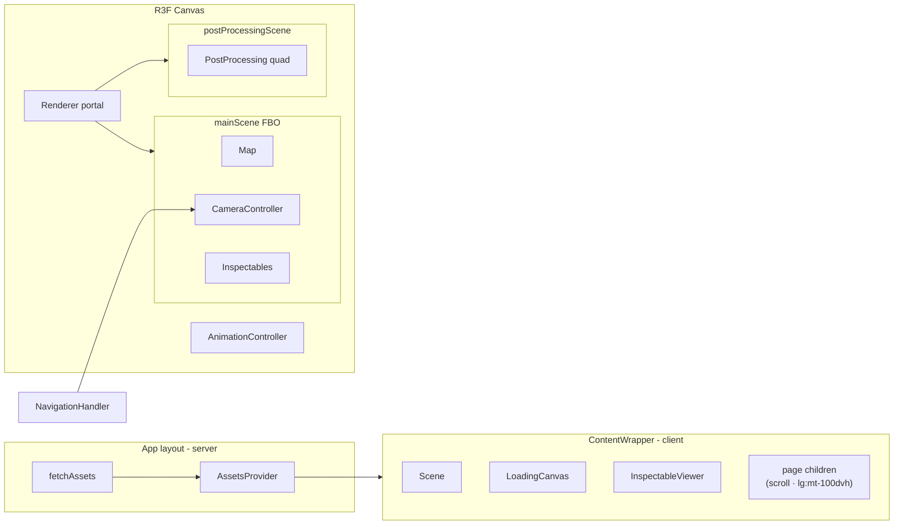
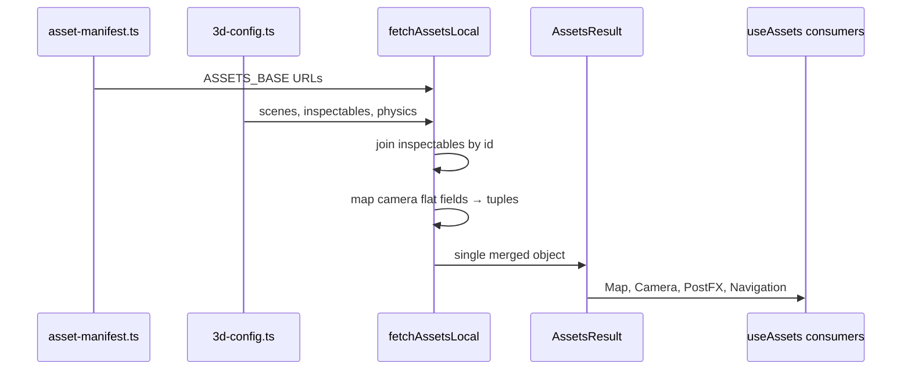

# Architecture — Responsive 3D Hero

Reference: `website-2k25` (basement-studio-clean fork).

## Runtime component graph



## Config → runtime merge



### `AssetsResult` shape (extend carefully)

Defined in `fetch-assets.ts`. Adding a field requires updating:

- `asset-manifest.ts` entry
- `fetch-assets-local.ts` if from config
- Every consumer via TypeScript errors

Key groups: map model URLs, bakes[], matcaps[], glassMaterials[], scenes[], inspectables[], sfx{}, videos[].

## Camera system detail

### Scene store (`navigation-store.ts`)

```ts
currentScene: IScene | null   // active route scene
previousScene: IScene | null  // for 404 → page slow transition (4s)
mainCamera: PerspectiveCamera // set by CameraController for Renderer
isCameraTransitioning: boolean
disableCameraTransition: boolean  // skip lerp once (e.g. initial load)
```

### `CustomCamera` invisible planes

Two invisible meshes at `calculatePlanePosition(cameraConfig)`:

- **Inner plane** (`width * 0.4`) — parallax reference
- **Boundary plane** (`width * 0.6`) — max pointer offset

`maxOffset = (boundary.scale.x - plane.scale.x) / 2`

Pointer X drives offset along `calculateMovementVectors()` right vector.

### Scroll coupling (desktop)

```ts
if (!disableCameraTransition && isDesktop) {
  const scrollFactor = Math.min(1, window.scrollY / window.innerHeight)
  targetPosition.y += (targetScrollY - initialY) * scrollFactor
  targetLookAt.y += (targetScrollY - initialY) * scrollFactor
}
```

`targetScrollY` is authored per scene in config — negative values pull camera down as user scrolls into content.

### Responsive divisor (`useResponsiveDivisor`)

| `innerWidth` | Divisor |
|--------------|---------|
| ≤1100 | 0.32 |
| ≤1200 | 0.36 |
| ≤1500 | 0.4 |
| ≤1600 | 0.8 |
| >1600 | 0.8 |

Used to scale look-at parallax delta: `panLookAtDelta = pos / divisor`.

## Route → scene mapping (full rules)

From `navigation-handler/index.tsx`:

```ts
const expectedScene = isNotFound
  ? scenes.find(s => s.name === "404")
  : pathname === "/" || pathname === "/index"
    ? scenes.find(s => s.name.toLowerCase() === "home")
    : pathname.startsWith("/post/")
      ? scenes.find(s => s.name === "blog")
      : pathname.startsWith("/careers/")
        ? scenes.find(s => s.name === "people")
        : scenes.find(s => s.name === pathname.split("/")[1])
```

Special cases:

- `/contact` → `home` camera (canvas hidden via blacklist)
- `isNotFound` flag must re-run effect even if pathname unchanged

### Tabs (3D hotspots)

Each scene may define `tabs[]`:

```ts
{
  tabName: "services_1",
  tabRoute: "services",           // navigates to /services
  tabHoverName: "Go to Services", // cursor label
  tabClickableName: "Services1_Hover", // GLB mesh name in routingElements.glb
  plusShapeScale: 1
}
```

`Map` matches `routingElements` mesh names → `RoutingElement` components.

## Renderer / postprocessing pipeline

1. **Main pass:** `gl.render(mainScene, mainCamera)` → `WebGLRenderTarget` (color + depth).
2. **CCTV pass (404 only):** secondary camera renders to `doubleFbo` for TV screen mesh.
3. **Post pass:** fullscreen shader samples color + depth textures; outputs to screen.

`frameloop="demand"` + `useFrameCallback` priority layers:

- Priority 1: main render + post
- Priority 2: flow simulation (loading scene)

`canRunMainApp` gate — loading sequence completes before main render runs.

## Map material pipeline

Traversal order: `office` → `officeItems` → `routingElements` → `outdoor` → `outdoorCars` → `godrays`.

Per mesh:

| Condition | Shader define |
|-----------|---------------|
| `glassMaterials.includes(material.name)` | `GLASS` |
| `videos.find(mesh)` | `VIDEO` |
| `matcaps.find(mesh)` | `MATCAP` |
| `mesh === "cloudy_01"` | `CLOUDS` |
| `mesh === "DL_ScreenB"` | `DAYLIGHT` |
| godrays traverse | `GODRAY: true` |
| outdoor traverse | `FOG: false` override |

`BakesLoader` assigns `lightMap` + `aoMap` from manifest bake groups by mesh name.

## Physics (optional per route)

`@react-three/rapier` loaded dynamically. Blog scene: lamp physics. Basketball: separate `PhysicsWorld`. Keep `paused` when scene inactive.

## HTML content vs canvas

Canvas and page copy are **separate layers**. All headlines, CTAs, and spec cards live in `layout-container` children with `lg:mt-[100dvh]` — never as absolute overlays on the canvas div.

See [html-layout.md](html-layout.md) for ContentWrapper template, z-index stack, and anti-patterns.

## File index (reference repo)

| Concern | Files |
|---------|-------|
| Config export | `src/content/3d-config.ts` |
| Manifest | `src/lib/3d-config/asset-manifest.ts`, `inspectables-meta.ts` |
| Merge | `src/components/assets-provider/fetch-assets-local.ts` |
| Types | `src/components/assets-provider/fetch-assets.ts` |
| Layout | `src/app/(site)/layout.tsx`, `content-wrapper.tsx` |
| Scene | `src/components/scene/index.tsx` |
| Map load | `src/components/map/use-loader.ts`, `index.tsx`, `bakes.tsx` |
| Camera | `src/components/camera/camera-*.tsx`, `camera-utils.ts` |
| PostFX | `src/components/postprocessing/*` |
| Shaders | `src/shaders/material-global-shader/`, `material-postprocessing/` |
| Loading | `src/components/loading/*`, `src/workers/loading-worker.tsx` |
| Assets scripts | `scripts/3d-assets/hash.ts`, `verify.ts` |
| Docs | `src/lib/3d-config/README.md` |
