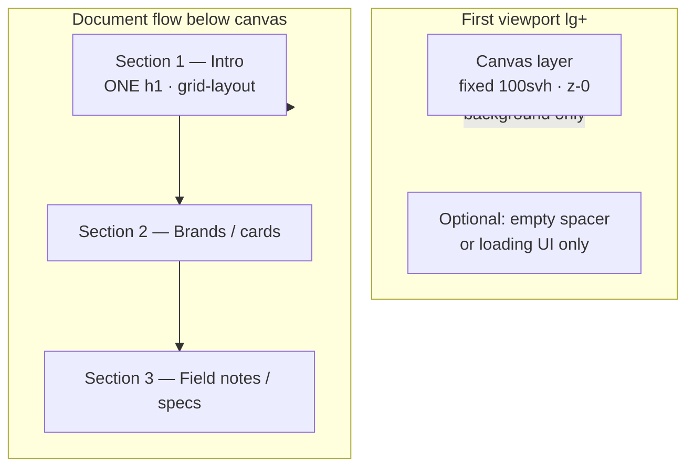

# HTML Content Layout — Canvas vs Scroll

Reference: `website-2k25` — `content-wrapper.tsx`, `(home)/intro.tsx`, `(home)/page.tsx`.

The #1 scaffold failure mode is **HTML overlapping the fixed canvas**: multiple headlines stacked, spec cards on top of the h1, unreadable z-index mess. This doc is the fix.

## Mental model: two layers, one scroll column



| Layer | Role | Positioning |
|-------|------|-------------|
| **Canvas** | 3D scene, wireframe loader | `lg:fixed lg:h-[100svh]` — **not** where page copy lives |
| **HTML content** | Headlines, body, CTAs, spec cards | Normal document flow inside `layout-container` with `lg:mt-[100dvh]` |
| **Chrome** | Navbar, cursor, modals | Fixed with explicit z-index above content |

**Rule:** On desktop, the user sees the 3D canvas pinned for the first viewport. When they scroll, HTML content scrolls **up over** the canvas — because content starts *below* the viewport (`lg:mt-[100dvh]`), not on top of it at load.

## Required ContentWrapper pattern

Copy this shell. Do not invent a parallel layout.

```tsx
// src/components/layout/content-wrapper.tsx
"use client"

import dynamic from "next/dynamic"
import { cn } from "@/utils/cn"

const Scene = dynamic(
  () => import("@/components/scene").then((m) => m.Scene),
  { ssr: false, loading: () => null }
)

export function ContentWrapper({ children }: { children: React.ReactNode }) {
  const shouldShowCanvas = true // gate per route if needed

  return (
    <>
      {/* Layer 0 — 3D canvas (background) */}
      <div
        className={cn(
          "canvas-container relative top-0 h-[80svh] w-full",
          "lg:fixed lg:aspect-auto lg:h-[100svh] lg:z-0"
        )}
      >
        <Scene />
      </div>

      {/* Layer 10 — all page HTML in scroll flow */}
      <div
        className={cn(
          "layout-container relative z-10",
          shouldShowCanvas && "lg:mt-[100dvh]"
        )}
      >
        {children}
      </div>
    </>
  )
}
```

### Why each class matters

| Class | Breakpoint | Purpose |
|-------|------------|---------|
| `h-[80svh]` | mobile | Canvas occupies top of page; content follows in flow (no overlap) |
| `lg:fixed lg:h-[100svh]` | desktop | Canvas pins to viewport; stays behind scroll |
| `lg:mt-[100dvh]` | desktop | **Critical.** Pushes `{children}` to start below the fixed canvas |
| `relative z-10` on content | all | Ensures HTML paints above canvas when scrolling |
| `lg:z-0` on canvas | desktop | Canvas stays background |

**Missing `lg:mt-[100dvh]`** → Intro, field notes, and spec cards render at `y=0`, directly on top of the hero headline and each other. This is the exact bug in the AETHEL scaffold screenshots.

## Homepage page structure (reference)

```tsx
// src/app/(site)/(pages)/(home)/page.tsx
export default function Homepage() {
  return (
    <div className="flex flex-col gap-18 lg:gap-32">
      <Intro />           {/* ONE section, ONE h1 — first scroll section */}
      <Brands />
      <FeaturedProjects />
      <Capabilities />
      <Contact />
    </div>
  )
}
```

```tsx
// src/app/(site)/(pages)/(home)/intro.tsx
export function Intro() {
  return (
    <section className="grid-layout">
      <article className="col-span-full flex flex-col gap-4 lg:col-span-11">
        <h1 className="text-f-h0-mobile lg:text-[5.4375rem]">
          {/* single headline — no second h1 elsewhere in viewport */}
        </h1>
        <p className="w-full lg:w-[60%]">{/* subtitle */}</p>
      </article>
    </section>
  )
}
```

Key points from reference:

- **No hero copy inside ContentWrapper's canvas div** — canvas is Scene only.
- **Intro is a normal `<section>`** — not `absolute inset-0`, not `fixed`, not a portal over the canvas.
- **One h1 per route** — subtitle is `<p>`, not a second headline block.
- **Sections stack vertically** with gap utilities — field notes / spec cards are a *later* section, not siblings occupying the same grid cell as Intro.

## Z-index stack

Use a small fixed scale. Do not sprinkle arbitrary z-50 on content sections.

| z-index | Element |
|---------|---------|
| `0` | Fixed canvas (`lg:z-0`) |
| `10` | `layout-container` (page content) |
| `20` | Sticky subnav / section labels (if any) |
| `50` | Navbar, custom cursor |
| `100+` | Modals, inspectable overlays, loading takeover |

Canvas and page sections should **never** compete at the same z-index.

## Where field notes / spec cards go

Spec cards (MOBILE, DESKTOP, ROUTES, camera notes, etc.) belong in one of these patterns:

### A — Below the fold (preferred for scaffolds)

A dedicated section **after** Intro in the page's flex column:

```tsx
<div className="flex flex-col gap-18 lg:gap-32">
  <Intro />
  <FieldNotes />  {/* MOBILE / DESKTOP / ROUTES cards here */}
</div>
```

User scrolls past the h1 to reach cards. No overlap possible.

### B — Sidebar grid on large screens (reference-style)

If cards sit beside copy, use **one grid row** with explicit columns — not two independent absolute layers:

```tsx
<section className="grid-layout">
  <article className="col-span-full lg:col-span-8">{/* h1 + body */}</article>
  <aside className="col-span-full lg:col-span-4 lg:col-start-9">
    {/* spec cards — same section, adjacent columns, NOT a second hero */}
  </aside>
</section>
```

Both columns share the section's document-flow position (below `lg:mt-[100dvh]`). They do not stack on the same coordinates.

### C — Never do this

- Spec cards in a `fixed` or `absolute` panel at `top-0` while Intro is also at `top-0`
- A "hero overlay" `<div className="absolute inset-0">` **plus** an Intro `<section>` with the same headline
- Field notes as a second `<h1>` or headline-sized title in the first viewport

## Anti-patterns (from AETHEL scaffold bug)

These produce the screenshots with stacked headlines and unreadable cards.

### ❌ Duplicate hero blocks

```tsx
{/* DON'T — two headlines in the same viewport */}
<div className="absolute inset-0 flex items-end p-8">
  <h1>Stones that remember the sun.</h1>
</div>
<section className="grid-layout">
  <h1>The courtyard still holds the wind.</h1>  {/* second h1, same y band */}
</section>
```

**Fix:** One hero copy block. Pick overlay **or** Intro section — reference uses Intro only (no text overlay on canvas).

### ❌ Field notes overlapping Intro

```tsx
{/* DON'T — spec section without mt offset, or absolute over hero */}
<div className="layout-container">  {/* missing lg:mt-[100dvh] */}
  <section><h1>Stones that remember the sun.</h1></section>
  <section><h2>Field notes</h2><SpecCards /></section>  {/* same viewport origin */}
</div>
```

Or worse:

```tsx
<section className="absolute top-32 left-0 w-full">
  <h2>Field notes</h2>
  <SpecCards />  {/* MOBILE / DESKTOP / ROUTES on top of h1 */}
</section>
```

**Fix:** `lg:mt-[100dvh]` on layout-container; Field notes as the next sibling section with vertical gap.

### ❌ Everything absolutely positioned in the hero

```tsx
{/* DON'T — z-index soup */}
<div className="relative h-screen">
  <Canvas className="absolute inset-0" />
  <h1 className="absolute bottom-24 left-8 z-10">...</h1>
  <aside className="absolute top-24 right-8 z-20">...</aside>
  <section className="absolute bottom-8 z-30">Field notes</section>
</div>
```

**Fix:** Canvas fixed; all copy in `layout-container` document flow.

### ❌ Multiple h1 elements

Accessibility and layout: **one `<h1>` per route**. Secondary titles use `<h2>` inside lower sections.

## Mobile vs desktop layout behavior

| Viewport | Canvas | HTML start position |
|----------|--------|---------------------|
| `< lg` | `80svh`, in document flow (not fixed) | Immediately below canvas — natural stack |
| `lg+` | `fixed 100svh` | `lg:mt-[100dvh]` — content begins below viewport |

On mobile, no margin hack needed — canvas height creates the spacer. On desktop, the margin hack is **mandatory**.

## Agent checklist (HTML layout)

Before marking layout done:

- [ ] ContentWrapper separates canvas div from `layout-container` children
- [ ] `lg:mt-[100dvh]` present when canvas is shown
- [ ] Exactly **one** h1 on the homepage route
- [ ] No `absolute` / `fixed` on Intro or field-notes sections (except navbar/modals)
- [ ] Spec / field-notes cards in a section **below** Intro or in a sidebar grid column — not at viewport origin
- [ ] Scroll test: at page load (desktop), h1 is visible in the content band below or scrolling into view — not hidden under cards
- [ ] z-index: canvas 0, content 10, chrome 50+

## Symptom → fix quick reference

| Symptom | Cause | Fix |
|---------|-------|-----|
| Two headlines stacked | Overlay + Intro both render | Remove overlay copy; keep one Intro section |
| Field notes on top of h1 | Missing `lg:mt-[100dvh]` or absolute positioning | Add margin; move cards to next section |
| Text unreadable / z-index mess | Multiple absolute layers at same coords | Document flow only; fixed z-index scale |
| Content hidden under canvas | No z-10 on layout-container | Add `relative z-10` |
| Mobile OK, desktop broken | Forgot desktop-only margin | Add `lg:mt-[100dvh]` (not just `mt-`) |
