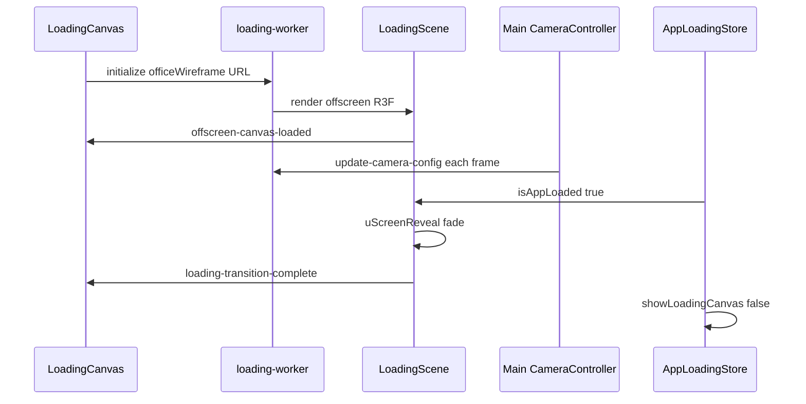

# Wireframe Loading + Shaders

## Loading sequence overview



## Wireframe GLB structure

`officeWireframe-d770f1ee.glb` (separate from shaded `office-077b4007.glb`):

| Node | Type | Role |
|------|------|------|
| `SM_Line` | `LineSegments` | Orange wire reveal sweep along Z |
| `SM_Solid` | `Group` | Parent |
| `SM_Solid_1` | `Mesh` | Solid fill with `createSolidRevealMaterial()` |

### Line reveal shader

- Uniform `uReveal` 0→1 drives edge position along world Z (`-4` to `-30`).
- Early frames: `lines.visible = sin(time * 50) > 0` flicker.
- Opacity 0.3 when stable; drops during handoff.

### Solid reveal

- `createSolidRevealMaterial()` — time-based reveal uniform `uReveal`.
- Flow simulation: secondary FBO (`doubleFbo 1024²`) with `createFlowMaterial()` for mouse trail on floor.
- `uScreenReveal` fades entire loading canvas when app ready.

### Camera sync

Main scene posts actual camera pose to worker:

```ts
loadingCanvasWorker.postMessage({
  type: "update-camera-config",
  actualCamera: { position: finalPos, target: finalLookAt, fov }
})
```

Loading scene copies into its `PerspectiveCamera` so wireframe intro matches final hero framing before dissolve.

## Offscreen canvas setup

```tsx
// loading-canvas.tsx
const worker = new Worker(new URL("@/workers/loading-worker.tsx", import.meta.url), { type: "module" })
worker.postMessage({ type: "initialize", modelUrl: officeWireframe })

<OffscreenCanvas worker={worker} frameloop="always" gl={{ antialias: true, alpha: true }} />
```

Worker (`loading-worker.tsx`) calls `render(<LoadingScene modelUrl={modelUrl} />)`.

Fallback: `FallbackLoading` component if worker unsupported.

## Global shader (main scene look)

`createGlobalShaderMaterial(baseMaterial, defines)` replaces every traversed mesh material.

Key uniforms:

- `uColor` — emissive accent `#FF4D00 * 9`
- `lightMap`, `aoMap` — from bakes
- `map`, `emissiveMap` — video screens
- `inspectingFactor`, `fadeFactor` — inspectable highlight
- `fogColor`, `fogDensity` — outdoor depth

Shader defines compiled per mesh:

```ts
{ GLASS, GODRAY, LIGHT, FOG, VIDEO, MATCAP, CLOUDS, DAYLIGHT }
```

Fragment shader (`fragment.glsl`): stylized shading — not PBR-accurate; tuned for basement aesthetic (high contrast, matcap highlights, fog).

### Material swap guard

```ts
if (meshChild.userData.hasGlobalMaterial) return
// ... create material ...
meshChild.userData.hasGlobalMaterial = true
```

Prevents double-swap on re-renders. Traverse runs once when all GLBs loaded.

## Postprocessing shader

`createPostProcessingMaterial()` — fullscreen pass sampling:

- `tDiffuse` — main render color
- `tDepth` — scene depth
- Uniforms animated from `assets.scenes[].postprocessing`

Mobile may skip expensive bloom paths — check `useDeviceDetect().isMobile` in post-processing component.

## KTX2 / GLB loading

`useKTX2GLTF` hook wraps `useGLTF` + KTX2Loader for compressed textures in GLBs.

Preload pattern:

```ts
useGLTF.preload(officeUrl)
```

Call from client init after assets resolve.

## Minimal loading (greenfield shortcut)

Skip worker entirely for v1:

1. CSS fade or simple `<Canvas>` with wireframe GLB.
2. `useProgress` from drei Suspense boundary.
3. Add offscreen worker when jank appears on low-end devices.

## Shader authoring tips

- Keep GLSL in separate `.glsl` files; import as strings (reference uses raw imports).
- Use `NearestFilter` on render targets for crisp pixel look.
- `HalfFloatType` render targets for postFX headroom.
- `frameloop="demand"` — call `invalidate()` from `useFrameCallback` when uniforms change.
